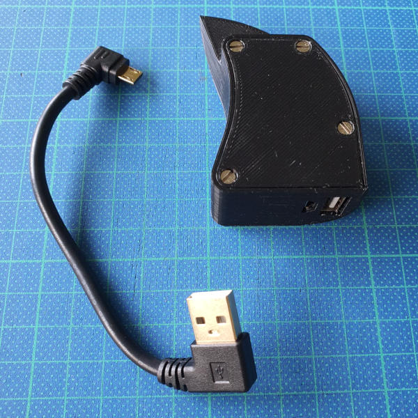
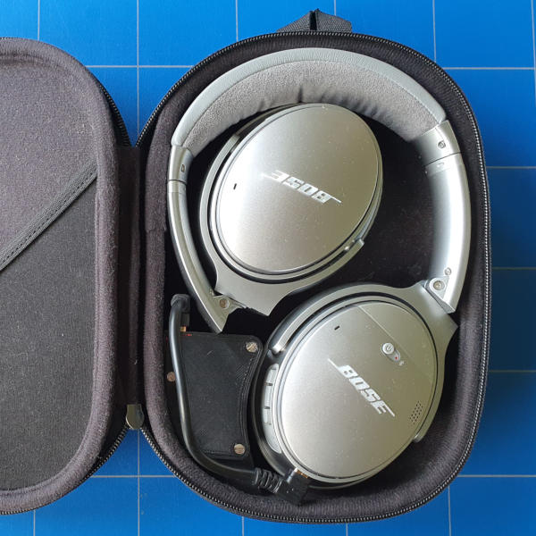
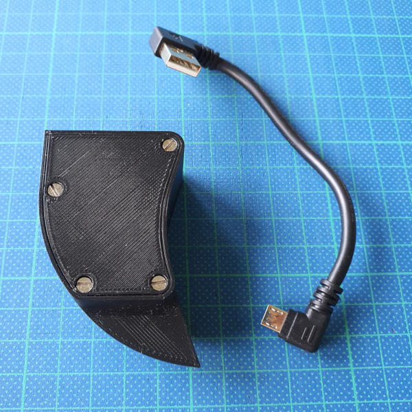
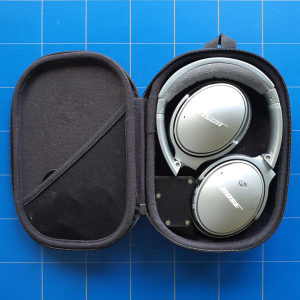

# QCPowerFin

Turn your Bose QuietComfort 35 / 35 II / 45 headphones case into a charging case by adding this 3D-printed custom-fit power bank!

> The design is currently in BETA version 0.9 state. Please test the design for some time before you consider glueing it into your case. That said, the electrical design is finished. The main thing that's left to check is mechanical tolerances and durability, especially when using different 3D printers. Please report back to me if you encounter any issues or if you have any suggestions for improvement.

## Key features

The QCPowerFin is designed to work with your original case.
|Fits | Bose QC 35 / 35 II / 45 / 45 SE |
|--|--|
|Input connector | Micro USB |
|Output connector | USB A |
|Battery capacity |`800mAh` |
|Battery voltage|`3.7V` |
|Battery Type | 16340 LiIon (rechargeable version of the CR123A cell) |

## How it works

The QCPowerFin fits neatly into your existing case. You can close the lid and charge your headphones on the go.

.
.

## What you need

After 3D-printing the enclosure and the lid, you only need a handful of cheap electronic components and some metal screws for holding the lid in place.

| Component | Description | Shop | Cost (app.)|
|-|-|-|-|
| Case | 3D-printed custom case; houses all the electronics.| - | - |
| Lid | 3D-printed custom lid; holds the battery and main PCB in place. | - | - |
| Main PCB | Power bank PCB with micro-USB input, full-size USB-A output, LED indicator, solder pads for the LiIon battery wires.| [Aliexpress](https://www.aliexpress.com/item/4001194744356.html) | ~2.50USD/5pcs |
| Battery-holder | CR123A / 16340 battery holder. *WARNING: this battery holder is not fool-proof. Check the polarity before inserting a battery or you risk damage to the device, injury, and/or fire!* | [Aliexpress](https://www.aliexpress.com/item/32899057473.html) | ~2.50USD/5pcs|
| Battery | The linked `800mAh` protected 18650 battery from Keeppower has exactly the same size as a regular CR123 battery so it nicely fits into the battery holder. *WARNING: To reduce risk of fire, damage and/or injury, always use a protected cell from a name brand (e.g. Trustfire, Keeppower) and shop locally, so you can contact the shop if you have any issues or questions.* | [Example battery](https://www.keeppower.com.cn/products_detail.php?id=635) | ~10-15€ |
| USB cable | 15cm (6in) USB cable with two angled connectors. | [Aliexpress](https://www.aliexpress.com/item/2255800232389543.html) | ~3.50USD |
| Screws | 5x M2.5 metal screws. Maximum length: 25mm (1in) | Hardware store | -|
| Wire |  Red and blue 0.25mm2 (24 AWG) wire. | Hardware store | - |

If you use any other battery successfully, please provide feedback so we can update the list.

## Assembly instructions

The basic steps to assemble the QCPowerFin are straight-forward. Once you are done, you can turn your existing headphone case into a charging case.

### Print the enclosure and the lid

* Download the STL files for the lid from here or [collect them on Thingyverse](https://www.thingiverse.com/thing:5938700).
* (If you want to play around with the Model, download the Autodesk Fusion 360 Archive and export the STL files yourself)
* Slice the STL files in your favorite slicer (e.g. as [CURA](https://ultimaker.com/software/ultimaker-cura) or [PrusaSlicer](https://www.prusa3d.com/page/prusaslicer_424/))
* Print the lid and the enclosure (I used a 0.4mm nozzle and 0.2mm layer thickness).

### Connect the battery holder to the main PCB

* Cut the red wire and the blue wire to a length of 8cm (3in) each.
* Strip the wire ends and twist them for easier soldering.
* Make a tiny loop with the bare wire ends of the red wire, lay the loop around the positive (+)-pin of the battery holder and solder it in place; be sure to have it run off at the correct angle to fit the cable guide on the bottom of the QCPowerFin case.
* Make a tiny loop with the bare wire ends of the blue wire, lay the loop around the negative (-)-pin of the battery holder and solder it in place; be sure to have it run off at the correct angle to fit the cable guide on the bottom of the QCPowerFin case.
* Insert the other end of the red wire through the positive (+) hole on the main PCB and solder it in place; be sure to insert it from the side of the small micro-USB connector or else you won't be able to insert the PCB.
* Insert the other end of the blue wire through the negative (-) hole on the main PCB and solder it in place; be sure to insert it from the side of the small micro-USB connector or else you won't be able to insert the PCB.

### Insert the main PCB and the battery holder into the case

* Slide the main PCB into the QCPowerFin case from the top.
* Insert the battery holder into the QCPowerFin case from the top; make sure the wires run through the cable guides on the bottom of the QCPowerFin case. Do not fit the battery holder with force.
* **If you cannot fit the battery**, check the size of your solder joints, check if the cables are angled and bent correctly, and check your printing tolerances, especially around the hole for the small orientation pin of the battery holder.
* **Optional**: Fixating the battery holder is not recommended. The battery holder it is held in place by the lid. If you choose to fixate it, you will need special flat-head screws with an ultra-low profile or else the battery wont fit in anymore. Don't ask me where to get those.

### Close the lid and screw it tight

* Fit the lid. It should not require much force. Ensure the main PCB is upright; it needs to fit into a slot at the bottom of the lid.
* There is no need to fixate the battery holder with screws. It should stay put when closing the lid.
* **If you cannot close the lid without applying force**, check if the main PCB is upright, check if the battery holder is in place, make sure the cables are not in the way and check your printing tolerances around the slot for the main PCB in the lid.
* Use the 5x M2.5 screws to screw the lid tight. Don't apply much torque, be gentle.

### Optional: Glue the QCPowerFin into the original case

* Glue the QCPowerFin into your original headphone case using hot glue. Do this at your own risk. Remove the battery before doing so as a matter of precaution.
* **WARNING** after you glue the QCPowerFin into the case, there is not really a going back. The glue melts the fabric in the case. If you plan to update the design, do it before you glue it!

## How to use

The QCPowerFin can be charged using a standard USB power supply or powered USB port. The QCPowerFin is able to give your headphones approximately one full charge, depending on the specific 16340 battery you got.

If you want to charge your headphones on the go, you should get a USB-A to micro-USB cable with angled connectors to reduce the stress on the connectors. Owners of the QC45 SE can buy an aftermarket case. Owners of the QC 35 will need to gently pull off the rubber holder for the airplane adapter before fitting the QCPowerFin:

## Known issues & limitations

The design is currently in BETA version 0.9 state. The electrical design is finished but the mechanical design might need some adjustments in terms of tolerances and for durability reasons, especially when using different 3D printers. Please report back if you encounter any issues or have ideas for improvement.

### Limitations

* Just like most regular power banks, the QCPowerFin does not support charging your headphones while it is plugged in.
* The design uses M2.5 metal screws to secure the lid. These might be difficult to source in parts of the world and they might not be the best option in terms of durability. Suggestions that work "worldwide" are welcome.

### Known issues

* The design has only been tested on one 3D printer (Creality Ender 3 V2 Neo) with a `0.4mm` nozzle, `0.2mm` layer thickness and moderate print speeds. Please open an issue if tolerances need to be increased for your printing service or setup.
* The Fusion 360 source files need some cleaning up. They are OK and mostly parametrized but you'll see what I mean when you open them ;).

Once I have received enough feedback, I will update the design to v1.0.

## LICENSE

Shield: [![CC BY 4.0][cc-by-shield]][cc-by]

This work is licensed under a
[Creative Commons Attribution 4.0 International License][cc-by].

[![CC BY 4.0][cc-by-image]][cc-by]

[cc-by]: http://creativecommons.org/licenses/by/4.0/
[cc-by-image]: https://i.creativecommons.org/l/by/4.0/88x31.png
[cc-by-shield]: https://img.shields.io/badge/License-CC%20BY%204.0-lightgrey.svg

## DISCLAIMER

The information contained in this repository is for general information purposes only. The information is provided by the contributors who make no representations or warranties of any kind, express or implied, about the completeness, accuracy, reliability, suitability or availability for any purpose, including but not limited to information, products, services, or related graphics. Any reliance you place on such information is therefore strictly at your own risk.

Also, the contributors are not affiliated with any of the shops or brands linked and discussed here. While they might have successfully tested the components in their own designs, they do not recommend any specific component from any manufacturer or shop in particular. Information about shops or products or manufacturers, including but not limited to links, are for illustrative purposed only. Manufacturers or distributors of electrical components are known to change a product's specification without notice.

## More Pictures

.
.
